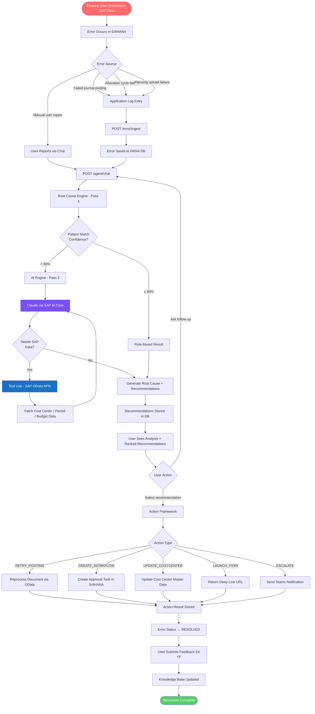
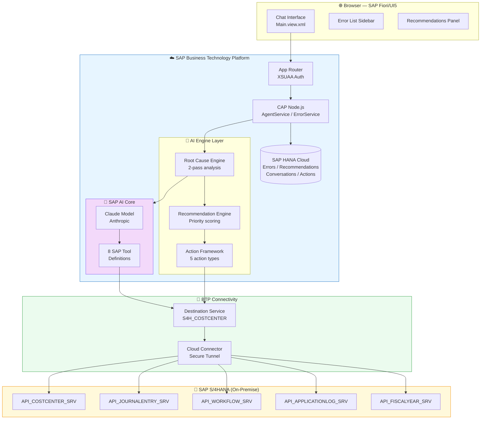
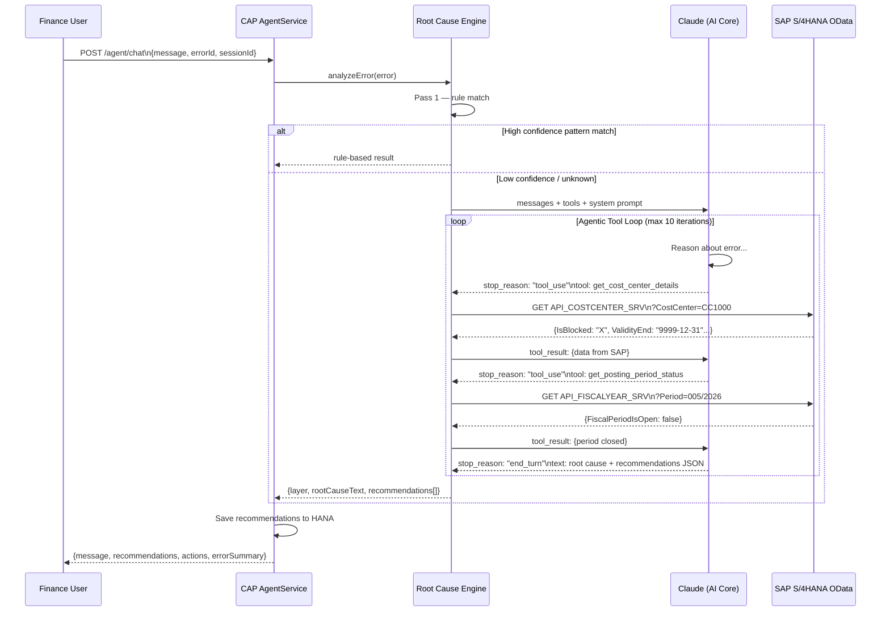
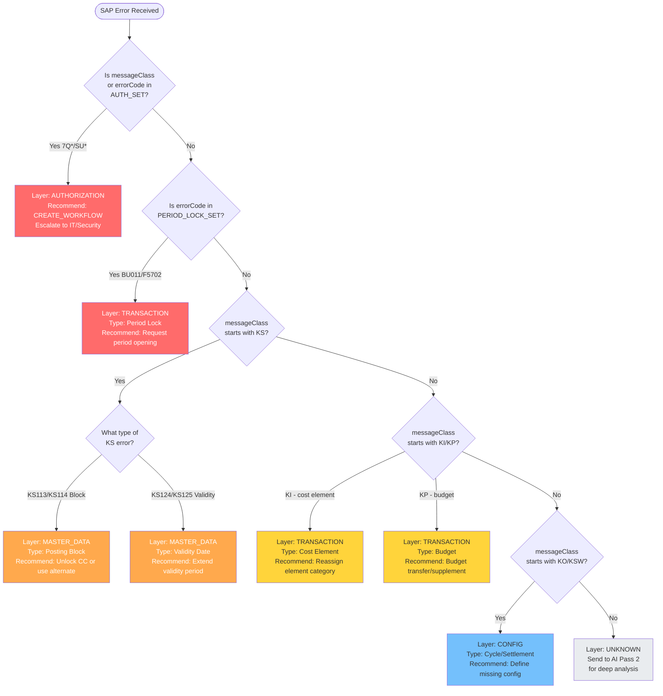
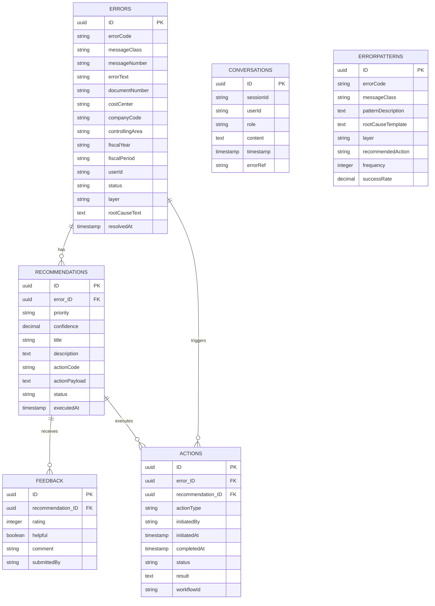
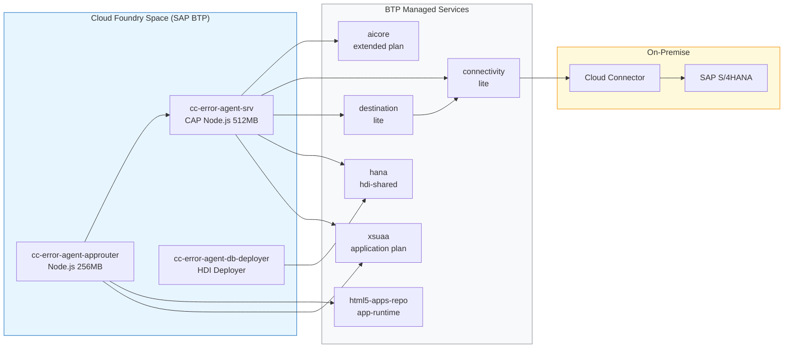
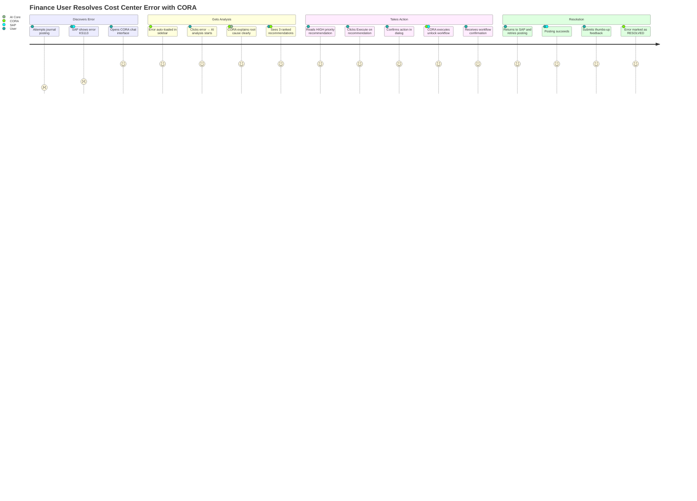

# 🔄 Flow Diagrams

## CORA — System & Process Flow Diagrams

> All diagrams use [Mermaid](https://mermaid.js.org/) syntax — rendered automatically on GitHub.

---

## 1. End-to-End Error Resolution Flow

---

## 2. System Architecture Diagram

---

## 3. AI Engine — Agentic Tool Use Loop

---

## 4. Error Classification Decision Tree

---

## 5. Data Model Entity Relationship

---

## 6. BTP Deployment Architecture

---

## 7. Month-End Close Process — Before vs After CORA

```mermaid
gantt
    title Month-End Close: Before vs After CORA
    dateFormat HH:mm
    axisFormat %H:%M

    section Before CORA
    Allocation cycle run        :active, a1, 00:00, 2h
    Error investigation (manual):crit,   a2, 02:00, 4h
    CO team triage              :crit,   a3, 06:00, 3h
    Error resolution            :crit,   a4, 09:00, 5h
    Re-run allocations          :        a5, 14:00, 2h
    Period close finalized      :        a6, 16:00, 1h

    section After CORA
    Allocation cycle run        :active, b1, 00:00, 2h
    CORA auto-analysis          :        b2, 02:00, 0.5h
    Self-service resolution     :        b3, 02:30, 1h
    Re-run allocations          :        b4, 03:30, 2h
    Period close finalized      :        b5, 05:30, 1h
```

---

## 8. User Journey — Self-Service Error Resolution

